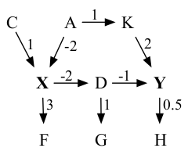
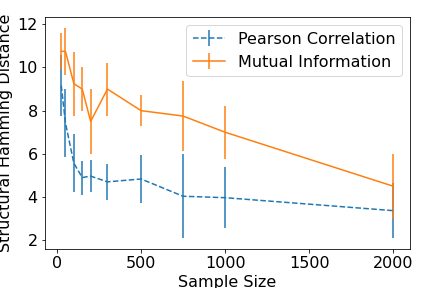
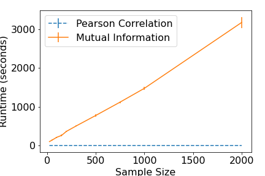

# causalPipeline
A collection of causal resources for psychologists and social scientists accompanying the paper:

'A Causal Research Pipeline and Tutorial for Psychologists and Social Scientists' (blinded for peer review).

This repository includes a Tutorial notebook ```causal_pipeline_tutorial.ipynb``` which steps through the analysis.

Utilises data acquired with permission from https://www.icpsr.umich.edu/web/ICPSR/studies/37404/summary


# Ubuntu Installation

To follow the steps of the pipeline, a variety of causal tools/packages are required. When running analyses with a wide variety of packages, dependency conflicts often arise. I therefore recommend a docker container is used (more on this below). In any case, the following steps for the installation of the packages using a common package manager such as anaconda are presented below.

## Complete Installation Example (with all conda and jupyter)
A complete example with a conda environment, and jupyter notebook (assumes nvidia-docker is already installed and working):

The installation is quite involved because the pipeline itself integrates tools from a wide variety of packages.

IMPORTANT: If you are using nvidia-docker, do not forget to commit/save the docker image when you are done!


### Environment Stuff
1. If using docker, open an nvidia-docker container:
```nvidia-docker run -ti -v /GitHub/Psych_ML/causalPipelineTEST:/tmp/CausalPipelineTEST -p 8889:8888 90d21486fcc7```
2. ```cd /tmp```
3. Update the docker: ```apt-get -y update```   and  ```apt-get -y install git```
4. ```apt-get install wget```
5. Download anaconda ```wget https://repo.anaconda.com/archive/Anaconda3-2023.07-0-Linux-x86_64.sh```
6. Install anaconda (keep defaults and set up```bash Anaconda3-2023.07-0-Linux-x86_64.sh```
7. Initialise conda  ```source /root/anaconda3/bin/activate```
8. Create new conda environment ```conda create -n causalPipeline_env python=3.7``` Note python 3.7 is required.


### CDT Stuff
1. Activate new environment ```conda activate causalPipeline_env```
2. ```cd /tmp/CausalPipelineTEST```
3. Clone the CDT repo: ```git clone https://github.com/FenTechSolutions/CausalDiscoveryToolbox.git```
4. ```cd CausalDiscoveryToolbox```
5. Install packages: ```python3 -mpip install -r requirements.txt```
6. ```python3 setup.py install develop --user ```


### Causal Effect Package
1. ```cd /tmp/CausalPipelineTEST```
2. Clone the causall effect package ```git clone https://github.com/pedemonte96/causaleffect```
3. ```cd causaleffect```
4. Install the package: ```python3 setup.py install```

### Install jupyter notebook, chardet, matplotlib, and seaborn
This is useful at least for following the tutorial file.

1. Activate the conda env (if not already activated): ```conda activate causalPipeline_env```
2. ```conda install -c anaconda jupyter -y```
3. ```pip3 install chardet```
4. ```conda install -c conda-forge matplotlib -y```  (may take some time)
5. ```conda install -c anaconda seaborn -y```

### Launch jupyter notebook
1. Activate the conda env (if not already activated): ```conda activate causalPipeline_env```
2. Select working directory ```cd /tmp/CausalPipelineTEST```
3. Launch jupyter notebook ```jupyter notebook --ip 0.0.0.0 --no-browser --allow-root```
3. [optional] if you get a 500 server error message, close the jupyter session Ctrl+C and try ```conda update jupyter``` then try step 3 again
4. Go to your internet browser:  ```http://localhost:8889/```
5. Login using the token given when you launched the notebook


### Commit to Docker (if using docker)
1. In a new terminal window, type ```docker ps``` this will tell you what is running
2. Identify the container you've just been working in, and commit it with a new name:
```docker commit <containerID> causalpipeline```


## Docker Notes (recommended to use SAM causal discovery)

This analysis uses SAM[1] which is included in the Causal Discovery Toolbox https://fentechsolutions.github.io/

The toolbox includes about 20 methods which are both python and R based, and which may use GPU.

Therefore, I recommend using a docker container, in particular with the nvidia-docker.

An example tutorial for docker is here: https://zetcode.com/python/docker/

And one for nvidia GPU is here:  https://towardsdatascience.com/use-nvidia-docker-to-create-awesome-deep-learning-environments-for-r-or-python-pt-i-df8e89b43a72

Once docker and nvidia-docker have been successfully installed, and sufficient permissions have been granted, run ```docker pull xxxx``` for the most recent
version of CDT.


You can list the available docker images by running ```docker images```

The (non nvidia-) docker image can be run interactively via

```
docker run -ti -v /folder/to/mount/:/tmp/folder -p 8889:8888 e5c643806d03
```


where the -p flag will enable you to run:

```jupyter notebook --ip 0.0.0.0 --no-browser --allow-root```

whilst accessing the associated jupyter server on the local host at:
```
localhost:8889/ 
```

After you ```exit``` the interactive docker image, you can save the image in its current state by first checking the container ID:

```docker ps``` 

and then commit it:

```docker commit <containerID> <new_name>```

If you want to remove/delete an image:
```docker rmi -f <image id> ```


For example, once everything is installed (assuming also that conda and jupyter notebook are being used):
```
nvidia-docker run -it --init --ipc=host -v /GitHub/Psych_ML/causalPipeline:/tmp/causalPipeline -p 8889:8888 8ee31bfa53e6 /bin/bash

cd /tmp/causalPipeline 

conda activate causal_env

jupyter notebook --ip 0.0.0.0 --no-browser --allow-root 
```

Then, access this via host with a browser: ```localhost:8889/tree‌```  


## Installing R packages

Pyhal uses rpy2==3.2.1 to call functions in R (rpy2 can be installed with ```python3 -mpip install rpy2==3.2.1```).

There is a list of packages needed in the rpacks.txt file. These can be installed by running:

```commandline
while IFS=" " read -r package version; 
do 
  R -e "install.packages('"$package"', lib='/usr/local/lib/R/site-library')"; 
done < "rpacks.txt"
```

and 

```commandline
while IFS=" " read -r package version; 
do 
  R -e "install.packages('"$package"', lib='/usr/lib/R/site-library')"; 
done < "rpacks.txt"
```


# (Extra) PC-Algorithm Evaluation Results

In the figures below we show extra results which are not included in the accompanying paper for the well-known PC algorithm Spirtes et al. 2000
The results illustrate the differences in performance (across a range of sample sizes) between a linear, correlation-based conditional independence test, and a nonparametric, k-nearest neighbours conditional mutual information based conditional independence test (Runge et al., 2018). 

We show below the true, 9-node, 9-edge graph for the underlying data generating structure. All exogenous (not shown) variables are Gaussian. 




In the next figure we show the Structural Hamming Distance, which is a measure of how successful the algorithm was at correctly inferring the graph (smaller the better). 



Finally, below we show the algorithm runtime (in seconds). Firstly, it can be seen that the correlation based measure is notably better at inferring the structure than the mutual information based approach, particularly for small sample sizes.
It can also be seen that the time taken to run the nonparametric version increases linearly with the sample size (over 50 minutes for a sample size of 2000) vastly exceeding the runtime of the correlation approach (which has a run of 0.26 seconds for a sample size of 2000). 
Thus, the price paid for not having to make parametric assumptions is one of both computation time and, for a parametric data generating process, accuracy. 
Of course, one expects that in cases where the parametric assumption does not hold, the advantages of non-parametric conditional independence tests become self-evident.



### REFERENCES

[1] Kalainathan, Diviyan & Goudet, Olivier & Guyon, Isabelle & Lopez-Paz, Dav